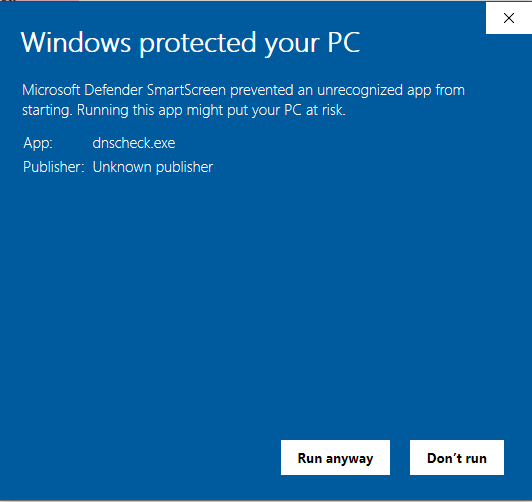

# Công cụ kiểm tra hoạt động truy vấn DNS đối với người dùng sử dụng dịch vụ FTTH của Viettel

[Download từ trang Release](https://github.com/biennt/dnscheck/releases)

Lần đầu chạy trên Windows, có thể có cảnh báo như dưới đây. 

Bấm vào "Run" để tiếp tục

Sau khi chạy xong, cửa sổ output sẽ hiện ra tương tự như hình dưới đây

